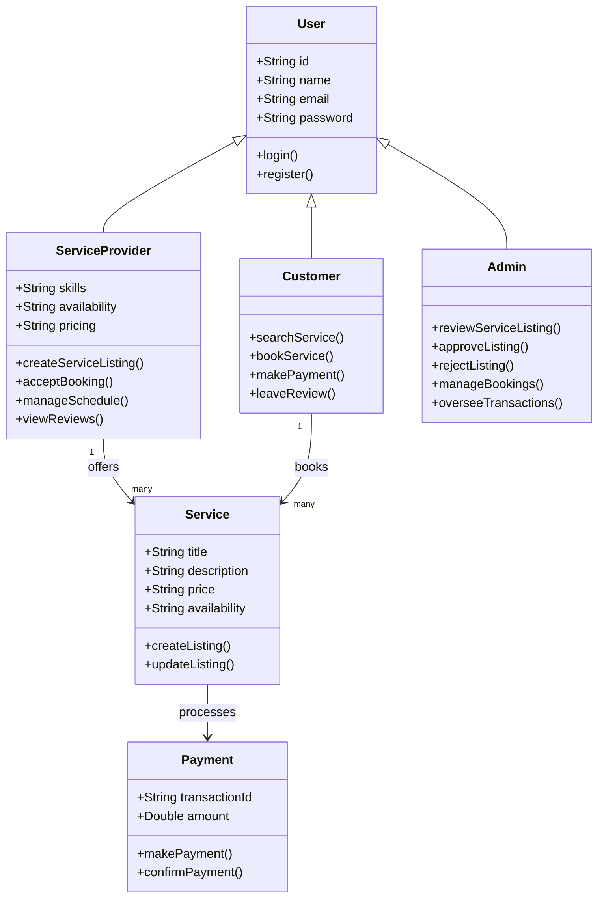

```mermaid
classDiagram
    class User {
        +String id
        +String name
        +String email
        +String password
        +login()
        +register()
    }

    class Customer {
        +searchService()
        +bookService()
        +makePayment()
        +leaveReview()
    }

    class ServiceProvider {
        +String skills
        +String availability
        +String pricing
        +createServiceListing()
        +acceptBooking()
        +manageSchedule()
        +viewReviews()
    }

    class Admin {
        +reviewServiceListing()
        +approveListing()
        +rejectListing()
        +manageBookings()
        +overseeTransactions()
    }

    class Service {
        +String title
        +String description
        +String price
        +String availability
        +createListing()
        +updateListing()
    }

    class Payment {
        +String transactionId
        +Double amount
        +makePayment()
        +confirmPayment()
    }

    User <|-- Customer
    User <|-- ServiceProvider
    User <|-- Admin
    ServiceProvider "1" --> "many" Service : offers
    Customer "1" --> "many" Service : books
    Service --> Payment : processes
```
