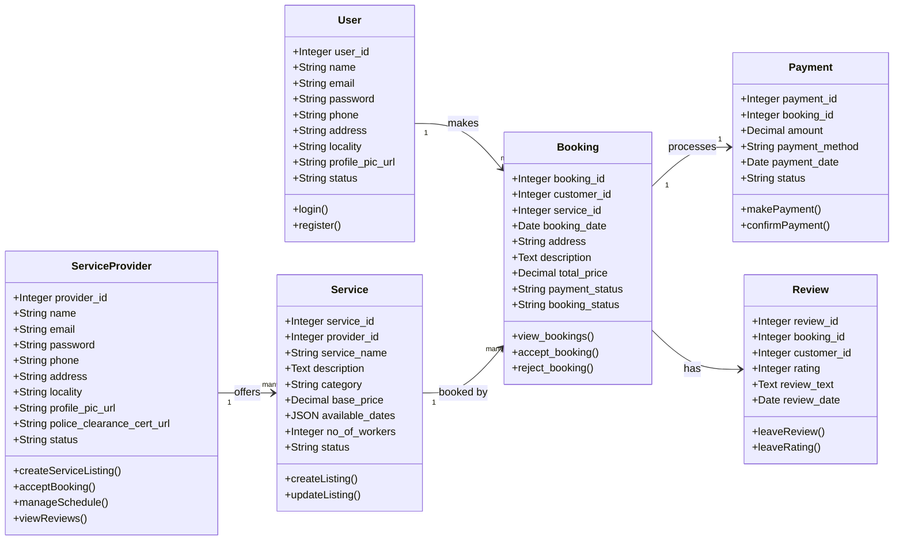

```mermaid
classDiagram
    direction LR

    class User {
        +Integer user_id
        +String name
        +String email
        +String password
        +String phone
        +String address
        +String locality
        +String profile_pic_url
        +String status
        +login()
        +register()
    }

    class ServiceProvider {
        +Integer provider_id
        +String name
        +String email
        +String password
        +String phone
        +String address
        +String locality
        +String profile_pic_url
        +String police_clearance_cert_url
        +String status
        +createServiceListing()
        +acceptBooking()
        +manageSchedule()
        +viewReviews()
    }

    class Service {
        +Integer service_id
        +Integer provider_id
        +String service_name
        +Text description
        +String category
        +Decimal base_price
        +JSON available_dates
        +Integer no_of_workers
        +String status
        +createListing()
        +updateListing()
    }

    class Booking {
        +Integer booking_id
        +Integer customer_id
        +Integer service_id
        +Date booking_date
        +String address
        +Text description
        +Decimal total_price
        +String payment_status
        +String booking_status
        +view_bookings()
        +accept_booking()
        +reject_booking()
    }

    class Payment {
        +Integer payment_id
        +Integer booking_id
        +Decimal amount
        +String payment_method
        +Date payment_date
        +String status
        +makePayment()
        +confirmPayment()
    }

    class Review {
        +Integer review_id
        +Integer booking_id
        +Integer customer_id
        +Integer rating
        +Text review_text
        +Date review_date
        +leaveReview()
        +leaveRating()
    }

    User "1" --> "many" Booking : makes
    ServiceProvider "1" --> "many" Service : offers
    Booking "1" --> "1" Payment : processes
    Service "1" --> "many" Booking : booked by
    Booking --> Review : has

```
