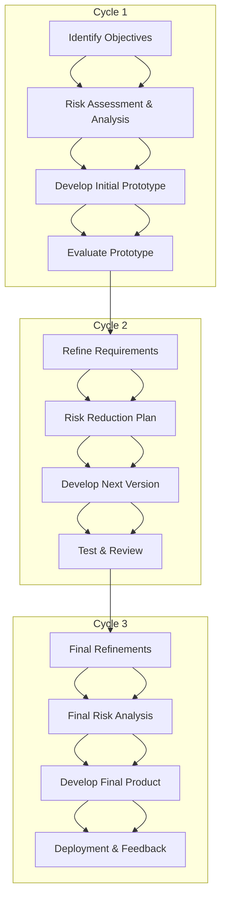

```mermaid
graph TD
    A1[Identify Objectives] --> B1[Risk Assessment & Analysis] 
    B1 --> C1[Develop Initial Prototype] 
    C1 --> D1[Evaluate Prototype]

    D1 --> A2[Refine Requirements]
    A2 --> B2[Risk Reduction Plan]
    B2 --> C2[Develop Next Version]
    C2 --> D2[Test & Review]

    D2 --> A3[Final Refinements]
    A3 --> B3[Final Risk Analysis]
    B3 --> C3[Develop Final Product]
    C3 --> D3[Deployment & Feedback]

    subgraph "Cycle 1"
        A1 --> B1 --> C1 --> D1
    end

    subgraph "Cycle 2"
        A2 --> B2 --> C2 --> D2
    end

    subgraph "Cycle 3"
        A3 --> B3 --> C3 --> D3
    end

```
