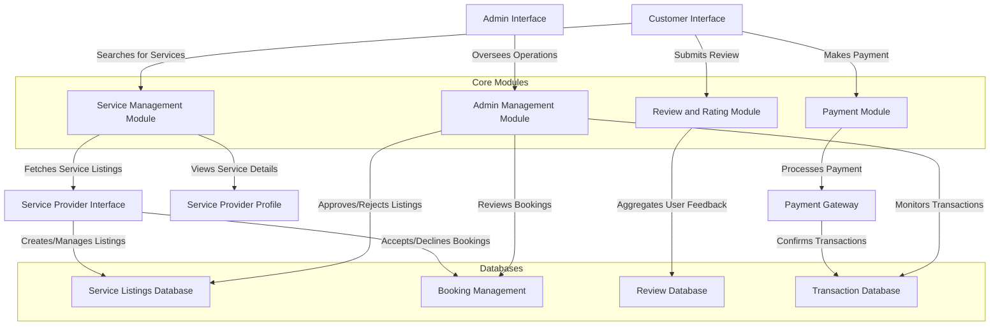

```mermaid
graph TD
    A[Customer Interface] -->|Searches for Services| B[Service Management Module]
    A -->|Makes Payment| C[Payment Module]
    A -->|Submits Review| D[Review and Rating Module]

    B -->|Fetches Service Listings| E[Service Provider Interface]
    B -->|Views Service Details| F[Service Provider Profile]

    E -->|Creates/Manages Listings| G[Service Listings Database]
    E -->|Accepts/Declines Bookings| H[Booking Management]

    D -->|Aggregates User Feedback| I[Review Database]

    C -->|Processes Payment| J[Payment Gateway]
    J -->|Confirms Transactions| K[Transaction Database]

    Admin[Admin Interface] -->|Oversees Operations| L[Admin Management Module]
    L -->|Approves/Rejects Listings| G
    L -->|Monitors Transactions| K
    L -->|Reviews Bookings| H

    subgraph "Core Modules"
        B
        C
        D
        L
    end

    subgraph "Databases"
        G
        H
        I
        K
    end
```
