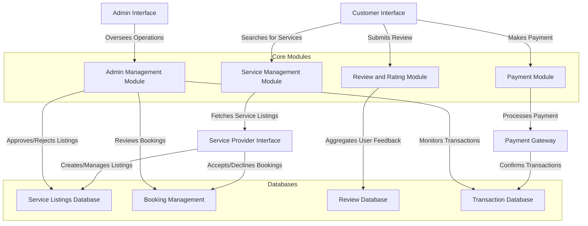

```mermaid
graph TD
    A[Customer Interface] -->|Searches for Services| B[Service Management Module]
    A -->|Makes Payment| C[Payment Module]
    A -->|Submits Review| D[Review and Rating Module]

    B -->|Fetches Service Listings| E[Service Provider Interface]
    E -->|Creates/Manages Listings| F[Service Listings Database]
    E -->|Accepts/Declines Bookings| G[Booking Management]

    D -->|Aggregates User Feedback| H[Review Database]

    C -->|Processes Payment| I[Payment Gateway]
    I -->|Confirms Transactions| J[Transaction Database]

    Admin[Admin Interface] -->|Oversees Operations| K[Admin Management Module]
    K -->|Approves/Rejects Listings| F
    K -->|Monitors Transactions| J
    K -->|Reviews Bookings| G

    subgraph "Core Modules"
        B
        C
        D
        K
    end

    subgraph "Databases"
        F
        G
        H
        J
    end


```
