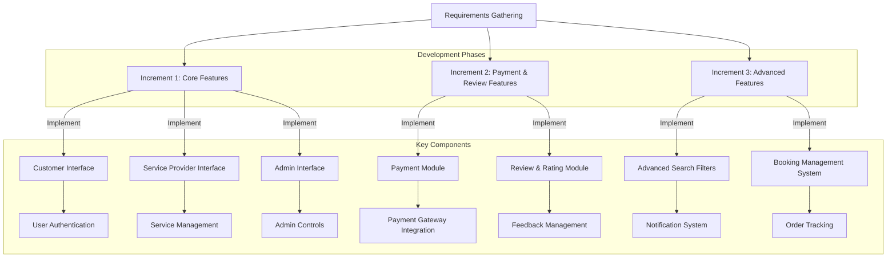

```mermaid
graph TD
    A[Requirements Gathering] --> B[Increment 1: Core Features]
    B -->|Implement| C[Customer Interface]
    B -->|Implement| D[Service Provider Interface]
    B -->|Implement| E[Admin Interface]
    C --> F[User Authentication]
    D --> G[Service Management]
    E --> H[Admin Controls]

    A --> I[Increment 2: Payment & Review Features]
    I -->|Implement| J[Payment Module]
    I -->|Implement| K[Review & Rating Module]
    J --> L[Payment Gateway Integration]
    K --> M[Feedback Management]

    A --> N[Increment 3: Advanced Features]
    N -->|Implement| O[Advanced Search Filters]
    N -->|Implement| P[Booking Management System]
    O --> Q[Notification System]
    P --> R[Order Tracking]

    subgraph "Development Phases"
        B
        I
        N
    end

    subgraph "Key Components"
        C
        D
        E
        F
        G
        H
        J
        K
        L
        M
        O
        P
        Q
        R
    end


```
